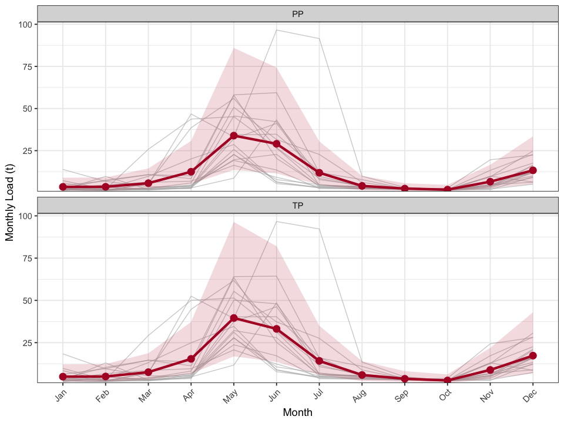
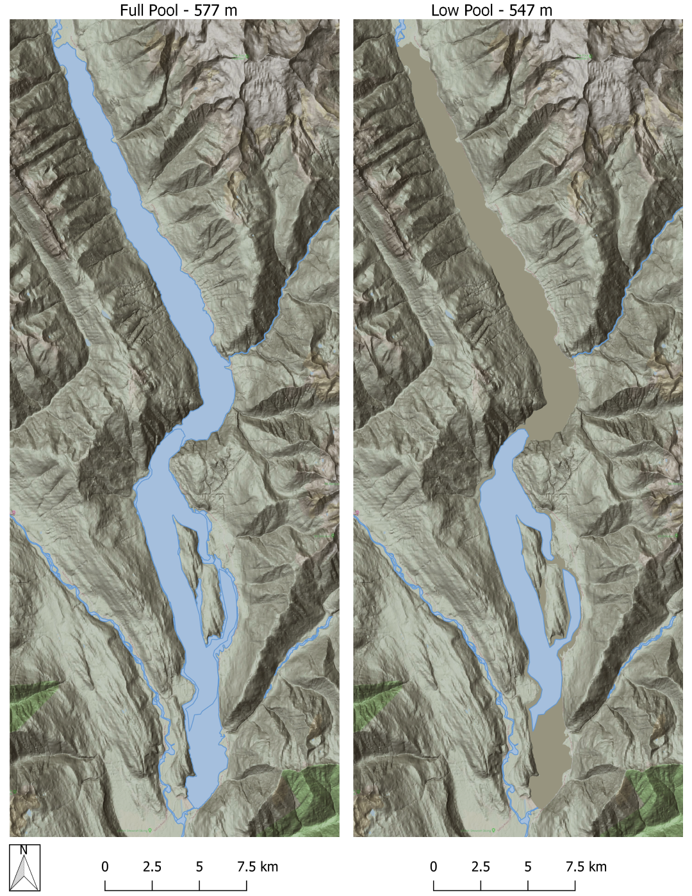
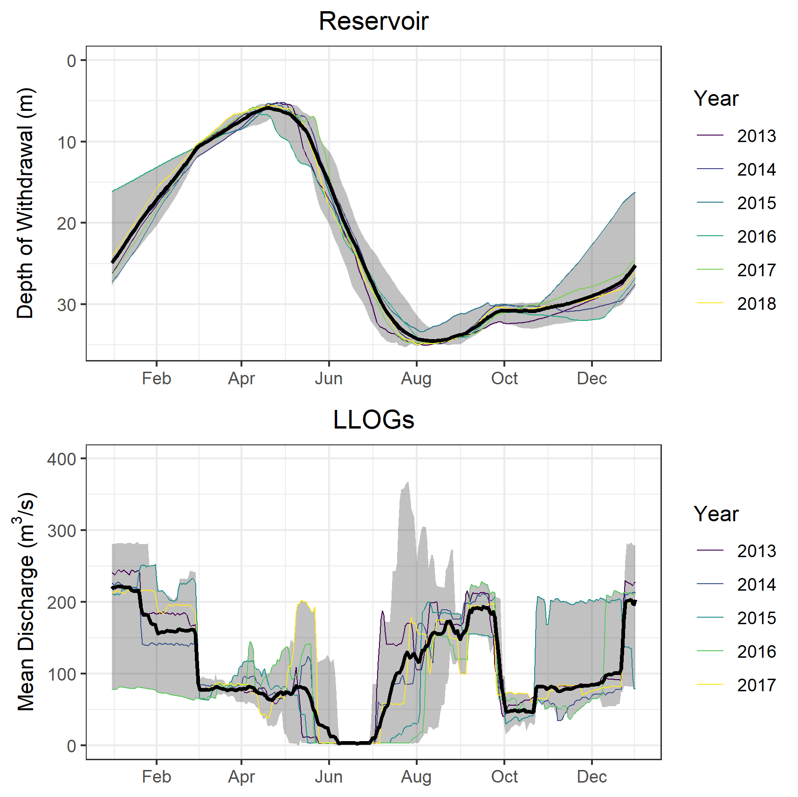
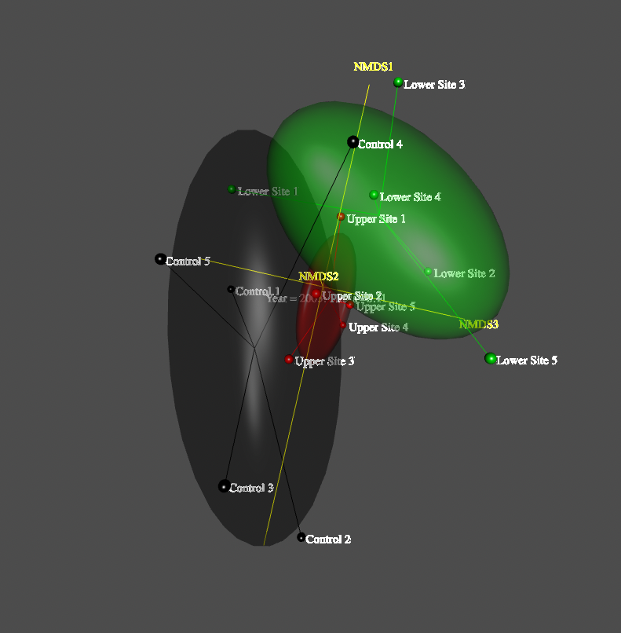
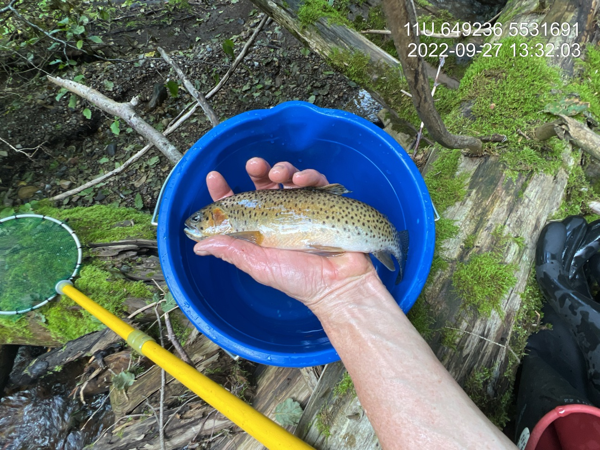

We provide data analysis, monitoring design, and reporting for long-term aquatic programs — from nutrient loading in large regulated reservoirs to biological impact assessment in small tributaries.

 

### Kootenay Lake & Arrow Lakes Nutrient Restoration Program

Data analysis and reporting for the Nutrient Restoration Program — a long-running initiative that applies limiting nutrients to Kootenay Lake and Arrow Lakes Reservoir to counter cultural oligotrophication caused by dam construction and operation. Our work quantifies natural nutrient loading alongside fertilizer additions, comparing dissolved phosphorus and nitrogen inputs across seasons and systems to assess the relative contribution of fertilization to biologically available nutrient supply during the growing season.

The analysis integrates hydrometric, water quality, and fertilization records spanning decades — bridging data from provincial monitoring systems, cross-border partnerships, and intensive sampling campaigns. Watershed delineation identifies unmonitored catchment contributions. Concentration-discharge modelling with uncertainty quantification provides loading estimates that inform adaptive management of fertilization timing and volumes to support kokanee populations.

 

 

### Duncan Reservoir Kokanee Stock Assessment

Data analysis, mapping and reporting to support large lake specialists on a multi-year synthesis report for a water use planning study. Reporting incorporated results and data from multiple water use planning projects in the Columbia Basin to explore impacts and mitigation strategies related to flow regulation and water impoundment in the Duncan River watershed. We built tools in R to automate the processing of hydroacoustic fish density outputs as well as associated water quality, zooplankton, and hydrometric data.

 

 

 

### Sheep Creek Biological Impact Assessment

Environmental impact assessment of landfill leachate on aquatic values in a major tributary to the Salmo River. Water quality impacts quantified using analysis of benthic macro-invertebrate and periphyton communities. Reproducible workflows conducted in R including standardization of multi-year project data and amalgamation within a sqlite database.

Non-metric Multidimensional Scaling (NMDS) ordination models incorporated in both report 2D plots and interactive 3D deliverables to communicate community assemblage patterns to environmental managers.

 

 

 

### Fish & Habitat Assessment

Extensive experience with stream classifications, detailed habitat assessments, and fish sampling to support restoration and responsible natural resource management. Work includes rapid and detailed habitat assessments, Fish Habitat Assessment Procedures, and electrofishing for fish presence, density, and movement analysis.

 

