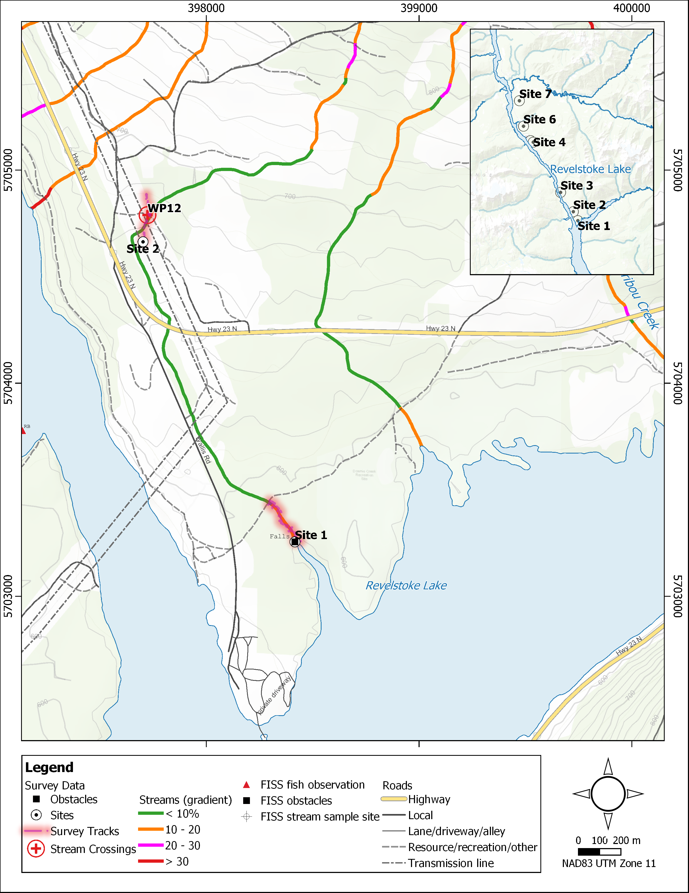
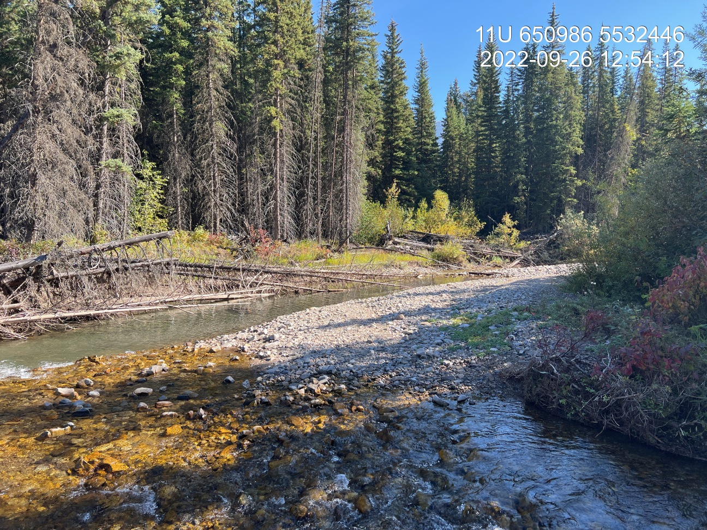
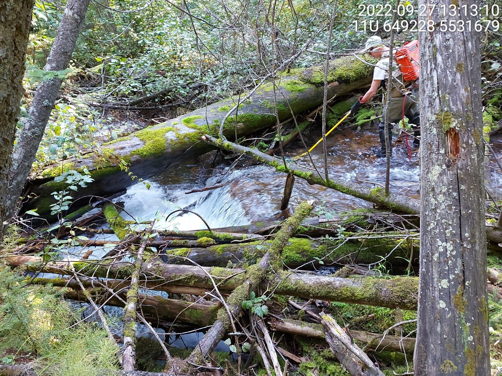
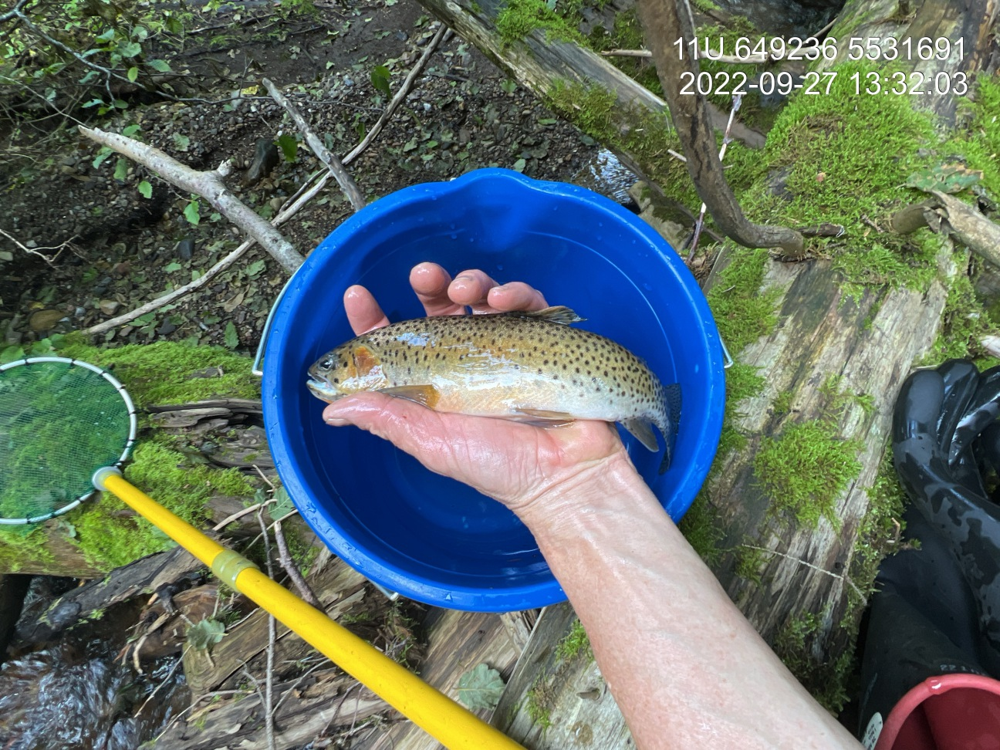
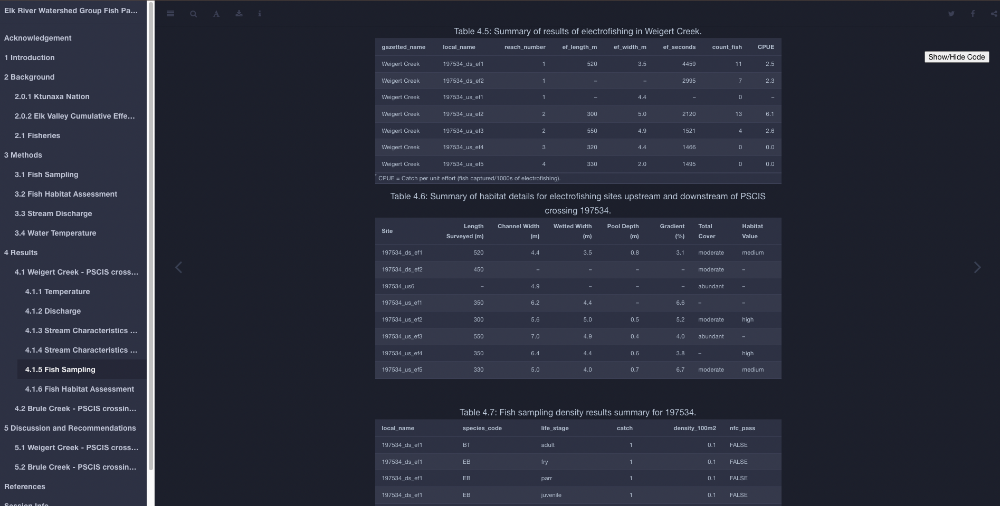

### Stream Classifications
Stream assessments are important for the conservation and restoration of viable habitat for fish and other aquatic organisms. We perform assessments to maintain or improve opportunities to sustainably use ecosystem values for sustenance, social, ceremonial, recreational and commercial purposes. We have extensive experience conducting stream classification work related to riparian setbacks and stream crossing structure determination with an example project presented [here](https://a100.gov.bc.ca/pub/acat/public/viewReport.do?reportId=62500) 

 

### Fish Habitat Assesssment
Our work includes numerous rapid and detailed habitat assessments for identifying needs and opportunities for fish habitat restoration.  In addition to inventory level standard habitat assessments we have extensive experience with detailed Fish Habitat Assessment Procedures that break habitat into meso-habitat features for detailed analysis of potential habitat for fish utilization.  An example of our work is presented [here](https://www.newgraphenvironment.com/fish_passage_elk_2022_reporting/results.html#weigert-creek---pscis-crossing-197534).

 

### Fish Sampling and Tracking
We commonly utilize electrofishing to determine fish presence and density with select projects tagging fish for health and movement analysis over time.  

 

 

