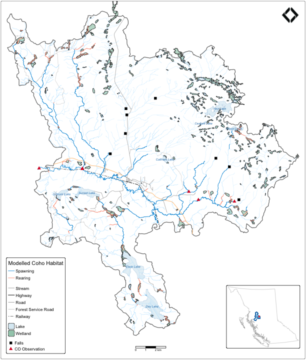
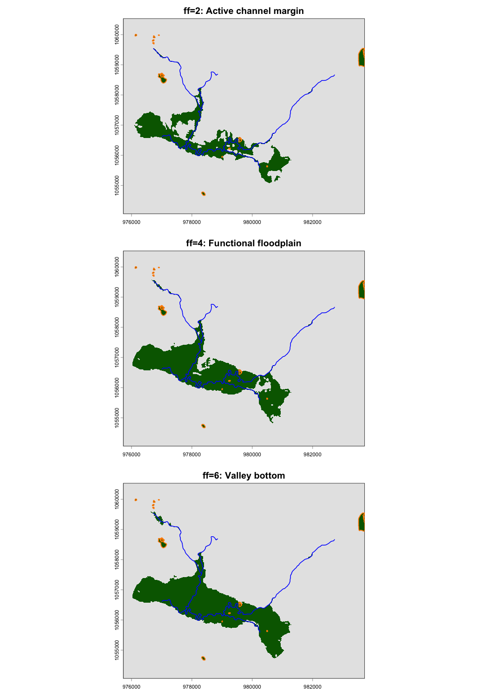
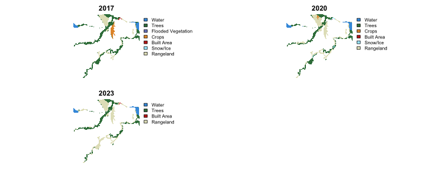
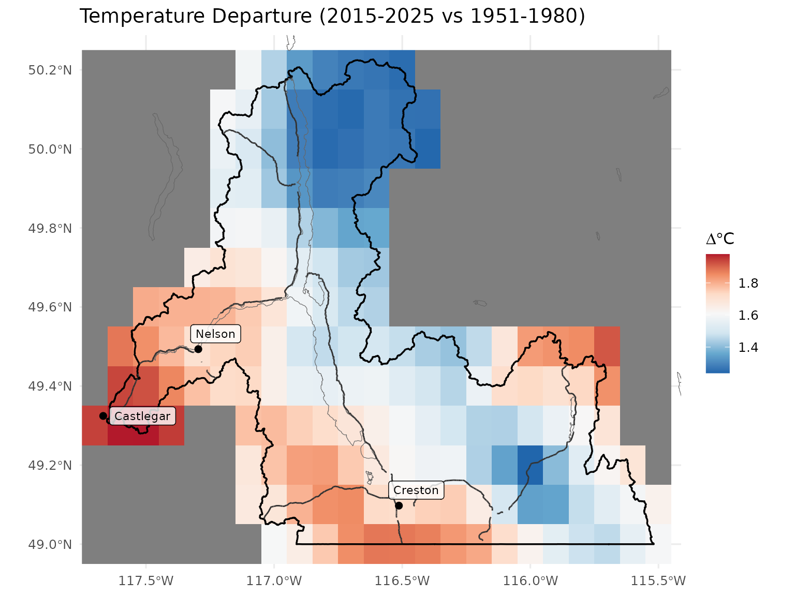
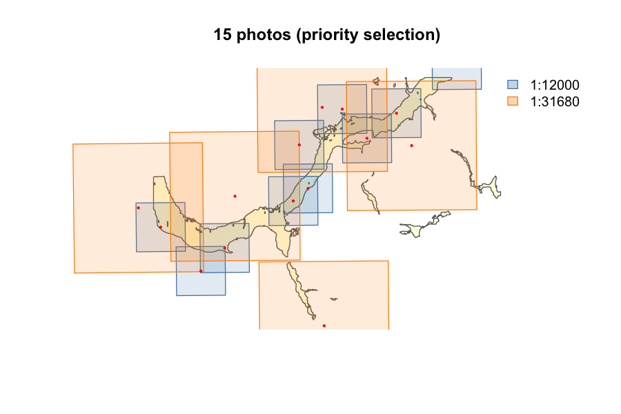

We develop and maintain open-source tools that power our work. Our core tools are built in R, Python, SQL, shell, OpenTofu, and GitHub Actions, and publicly available on GitHub. We work in the open because transparent methods produce better science. The packages highlighted here are designed to work together — network analysis feeds floodplain delineation, historic imagery feeds change detection, and field data flows through to published reports.

 

## Watershed Modelling

Composable tools for understanding watersheds — habitat classification, barrier prioritization, floodplain delineation, land cover change, historic condition, and climate trends. Built on the Freshwater Atlas and designed to work alongside provincial connectivity models.

### fresh — Freshwater Referenced Spatial Hydrology

A composable stream network modelling engine. Query and extract stream networks, classify habitat by gradient and channel width, segment networks at barriers and break points, aggregate features upstream or downstream, and run multi-species habitat modelling with parallel workers. Supports custom model outputs and attribute joining — channel width, mean annual discharge, precipitation, or any scalar value. Currently running on BC's Freshwater Atlas, designed to model fish habitat, connectivity, water temperature, channel morphology, and custom attributes for any species or question on any stream network.

- [Documentation](https://www.newgraphenvironment.com/fresh/) | [Source](https://github.com/NewGraphEnvironment/fresh)

 

 

### link — Network Point Matching and Scoring

Match, score, and interpret any point data on the stream network — crossing barriers, temperature monitoring stations, fish density sample sites, water quality stations, or traditional use locations. Column-agnostic and configurable: ship with BC fish passage defaults but work for any jurisdiction or data type. Produces break source specs that fresh consumes directly, and reads fresh output back for per-point upstream habitat rollup. Currently powering fish passage prioritization across the province, with the same architecture ready for any network-referenced analysis.

- [Documentation](https://www.newgraphenvironment.com/link/) | [Source](https://github.com/NewGraphEnvironment/link)

 

### flooded — Floodplain Delineation

Delineate functional floodplains from DEMs and stream networks using the Valley Confinement Algorithm. Identify where floodplains are intact, confined, or disconnected — the areas where rivers do geomorphic work including sediment storage, nutrient exchange, and riparian recruitment.

- [Documentation](https://www.newgraphenvironment.com/flooded/) | [Source](https://github.com/NewGraphEnvironment/flooded)

 

 

### drift — Detecting Riparian and Inland Floodplain Transitions

Fetch satellite-derived land cover data from STAC catalogs and track what's changing inside floodplains over time. Multi-year analysis from Esri IO LULC and ESA WorldCover. Integrates with flooded to focus change detection on the ecologically relevant floodplain extent.

- [Documentation](https://www.newgraphenvironment.com/drift/) | [Source](https://github.com/NewGraphEnvironment/drift)

 

 

### cd — Climate Departure

Climate departure analysis from ERA5-Land reanalysis data. Derive temperature, precipitation, vapour pressure deficit, and soil moisture trends for any watershed. Served as cloud-hosted catalogs for integration with other pipelines.

- [Documentation](https://www.newgraphenvironment.com/cd/) | [Source](https://github.com/NewGraphEnvironment/cd)

 

 

### fly — Airphoto Retrieval and Coverage Selection

Download and georeference historic airphotos, estimate ground footprints from centroids and film scale, compute coverage over areas of interest, and select minimum photo sets. Visualize past watershed conditions from decades of provincial aerial photography — the ground truth behind satellite-derived change detection. Outputs feed into stac_airphoto_bc for cataloging.

- [Documentation](https://www.newgraphenvironment.com/fly/) | [Source](https://github.com/NewGraphEnvironment/fly)

 

 

---

 

## Spatial Data Infrastructure

Provincial-scale imagery, elevation data, and stream temperature records — catalogued and queryable from R, QGIS, and Python. Cloud-hosted tile serving for on-the-fly visualization of massive rasters.

| Collection | Content | Scale |
|-----------|---------|-------|
| [**stac_dem_bc**](https://github.com/NewGraphEnvironment/stac_dem_bc) | LiDAR elevation models | 50,000+ tiles, province-wide |
| [**stac_airphoto_bc**](https://github.com/NewGraphEnvironment/stac_airphoto_bc) | Historic aerial photographs (1963–2019) | Growing, ~10,000 georeferenced thumbnails |
| [**stac_orthophoto_bc**](https://github.com/NewGraphEnvironment/stac_orthophoto_bc) | Provincial orthophoto collection | Province-wide |
| [**stac_uav_bc**](https://github.com/NewGraphEnvironment/stac_uav_bc) | Drone imagery by watershed | Project-based, growing |
| [**water-temp-bc**](https://github.com/NewGraphEnvironment/water-temp-bc) | Stream temperature from federal hydrometric stations | Province-wide, cloud-hosted |

 

### water-temp-bc — Stream Temperature Data

Stream temperature records from federal hydrometric stations across BC — scraped from Environment and Climate Change Canada's real-time web service and combined with historic data extracts. Served as cloud-hosted files queryable from R without a database.

This data feeds into collaborative science with [Poisson Consulting](https://www.poissonconsulting.ca/) and [Hillcrest Geographics](https://hillcrestgeo.ca/) that is advancing fish habitat modelling across the province — spatial stream network temperature modelling ([Skeena 2025](https://www.poissonconsulting.ca/f/1130667589), [Nechako 2022](https://www.poissonconsulting.ca/f/1295467017)) and [channel width regression models](https://www.poissonconsulting.ca/temporary-hidden-link/859859031/channel-width-21b/) that integrate with fresh and link for habitat classification.

- [Data](https://www.newgraphenvironment.com/water-temp-bc/) | [Source](https://github.com/NewGraphEnvironment/water-temp-bc)

 

---

 

## Field-to-Report Workflows

Reproducible, field-ready GIS projects for any watershed in the province. Digital field forms, collaborative workspaces, and automated reporting — office to field and back.

### rfp — Reproducible Field Projects

GIS project assembly and digital field form management. Pull provincial datasets from the BC Data Catalogue, Freshwater Atlas, and cloud-hosted layers, clip to any set of watershed groups, and assemble a fully styled QGIS project with digital field forms — ready to deploy to mobile devices for collaborative offline field collection.

We build and maintain forms for fish passage assessment, habitat confirmation, effectiveness monitoring, restoration site investigation, eDNA sampling, and benthic invertebrate collection — with more added as programs evolve. Data collected in some forms is structured for direct submission to provincial database systems (FISS, PSCIS, CABIN), while other data lands within central database systems we maintain and share with partners. Photos are automatically renamed and organized into site directories. Multiple team members contribute within the same shared project, with changes syncing between field and office.

- [Documentation](https://www.newgraphenvironment.com/rfp/) | [Source](https://github.com/NewGraphEnvironment/rfp)

 

---

 

## Dynamic Reporting

We pioneered interactive, version-controlled environmental reporting in British Columbia. One set of source files produces both an interactive online report and a print-ready PDF — complete with maps, figures, tables, cross-references, and citations. When new data arrives or methods are refined, the report rebuilds. Every analysis is reproducible, every change is tracked, and every report is publicly accessible.

This approach has produced hundreds of deliverables across fish passage, restoration planning, nutrient loading, and aquatic assessment programs. See live examples in our [Watershed Restoration & Conservation](/project/watershed_restoration_fish_passage/) and [Aquatic Monitoring & Assessment](/project/aquatic_monitoring_assessment/) work.

