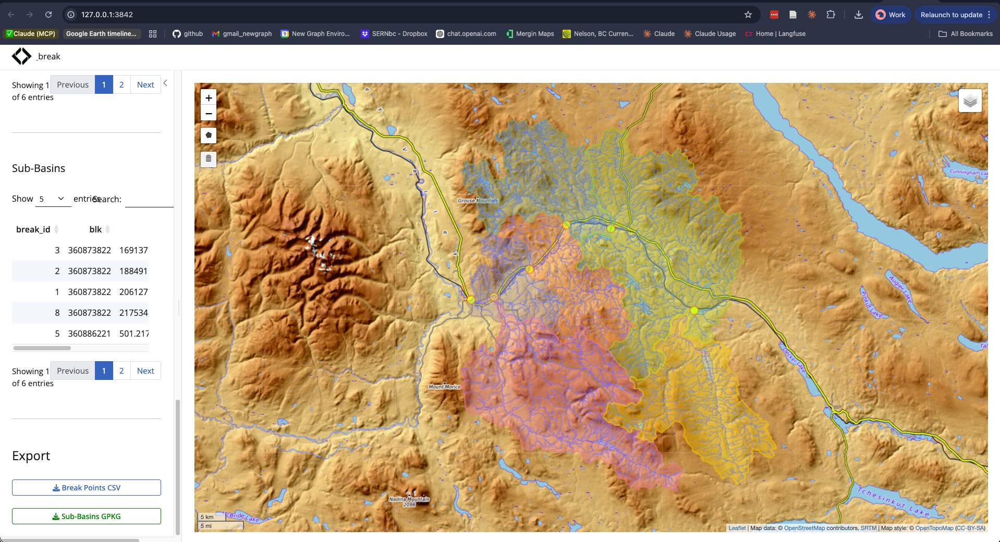
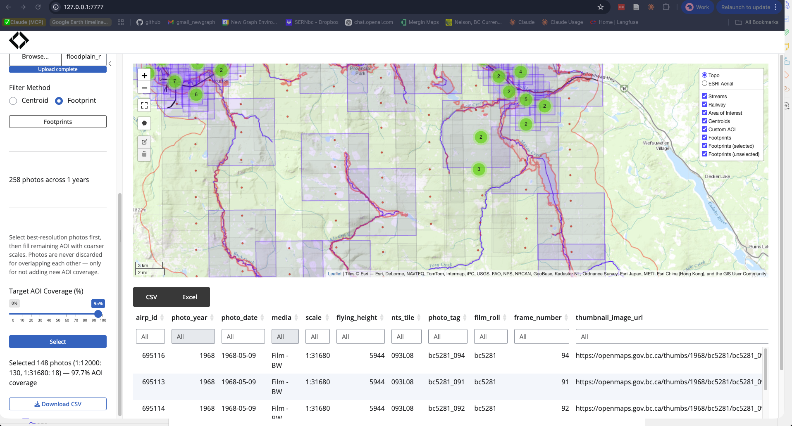

We develop and maintain open-source tools that power our work and are freely available to the broader watershed community. Everything is built in R, hosted on GitHub, and documented with pkgdown sites.

 

## Watershed Analysis

Integrated planning from stream connectivity to floodplain health to land cover change. Our tools build on provincial stream network and fish passage models, extending them into broader watershed health assessment.

### fresh — Spatial Hydrology

Stream network-aware spatial operations via direct SQL against provincial databases. Query habitat, delineate watersheds, and map connectivity for any stream in BC.

- [Documentation](https://www.newgraphenvironment.com/fresh/) | [Source](https://github.com/NewGraphEnvironment/fresh)

 

 

### flooded — Floodplain Delineation

Delineate functional floodplains from DEMs and stream networks using the Valley Confinement Algorithm. Identify where floodplains are intact, confined, or disconnected.

- [Documentation](https://www.newgraphenvironment.com/flooded/) | [Source](https://github.com/NewGraphEnvironment/flooded)

 

 

### drift — Land Cover Change Detection

Fetch satellite-derived land cover data from STAC catalogs and track what's changing inside floodplains over time. Multi-year analysis from Esri IO LULC and ESA WorldCover.

- [Documentation](https://www.newgraphenvironment.com/drift/) | [Source](https://github.com/NewGraphEnvironment/drift)

 

 

### breaks — Interactive Watershed Delineation

A Shiny app for placing break points on stream networks and delineating sub-basins. Click, snap to the Freshwater Atlas, compute upstream watersheds, and export.

- [Documentation](https://www.newgraphenvironment.com/breaks/) | [Source](https://github.com/NewGraphEnvironment/breaks)

 

 

### cd — Climate Departure Analysis

Climate departure analysis from ERA5-Land reanalysis data. Derive temperature, precipitation, vapour pressure deficit, and soil moisture trends for any watershed.

- [Documentation](https://www.newgraphenvironment.com/cd/) | [Source](https://github.com/NewGraphEnvironment/cd)

 

---

 

## Spatial Data Infrastructure

Provincial-scale imagery and elevation data, catalogued and queryable from R, QGIS 3.42+, and Python. Cloud-hosted tile serving for on-the-fly visualization of massive rasters.

### STAC Catalogs

| Collection | Content | Scale |
|-----------|---------|-------|
| [**stac_dem_bc**](https://github.com/NewGraphEnvironment/stac_dem_bc) | LidarBC digital elevation models | 50,000+ tiles, province-wide |
| [**stac_airphoto_bc**](https://github.com/NewGraphEnvironment/stac_airphoto_bc) | Historic aerial photographs (1963–2019) | Growing, ~10,000 georeferenced thumbnails |
| [**stac_orthophoto_bc**](https://github.com/NewGraphEnvironment/stac_orthophoto_bc) | BC orthophoto collection | Province-wide |
| [**stac_uav_bc**](https://github.com/NewGraphEnvironment/stac_uav_bc) | UAV imagery by watershed | Project-based, growing |

 

### fly — Airphoto Footprint Estimation

Estimate ground footprints from airphoto centroids and scale, compute coverage over an area of interest, and select minimum photo sets using greedy set-cover optimization.

- [Documentation](https://www.newgraphenvironment.com/fly/) | [Source](https://github.com/NewGraphEnvironment/fly)

 

### diggs — Historic Airphoto Explorer

An interactive Shiny app that leverages fly's footprint estimation to let users browse and select historic BC aerial photography by location, year, scale, and media type.

- [Documentation](https://www.newgraphenvironment.com/diggs/) | [Source](https://github.com/NewGraphEnvironment/diggs)

 

 

---

 

## Field-to-Report Workflows

Reproducible, field-ready GIS projects for any watershed in the province. Digital field forms, collaborative workspaces, and automated reporting — office to field and back.

### GIS Project Assembly & Digital Field Forms

Shell scripts pull provincial datasets from the BC Data Catalogue, Freshwater Atlas, and cloud-hosted layers, clip them to any set of watershed groups, and assemble a fully styled QGIS project with digital field forms — ready to deploy to Mergin Maps for collaborative offline field collection.

Field forms for fish passage assessment (PSCIS) and habitat confirmation write directly to provincial database schemas. Photos are automatically renamed and organized into site directories.

- [Source](https://github.com/NewGraphEnvironment/dff-2022)

 

### fpr — Fish Passage Reporting

Data wrangling and reporting functions for fish passage projects. Photo EXIF parsing, standardized tables and figures, knitr integration.

- [Documentation](https://www.newgraphenvironment.com/fpr/) | [Source](https://github.com/NewGraphEnvironment/fpr)

### ngr — Reporting Utilities

Dynamic reporting tools including STAC integration, COG viewers, and document generation helpers.

- [Documentation](https://www.newgraphenvironment.com/ngr/) | [Source](https://github.com/NewGraphEnvironment/ngr)

### gq — Cartographic Style Registry

One style registry drives every map — print, web, and field. Extracts symbology from QGIS projects, stores it in canonical JSON, and translates to tmap, MapLibre GL, leaflet, and ggplot2.

- [Documentation](https://www.newgraphenvironment.com/gq/) | [Source](https://github.com/NewGraphEnvironment/gq)

