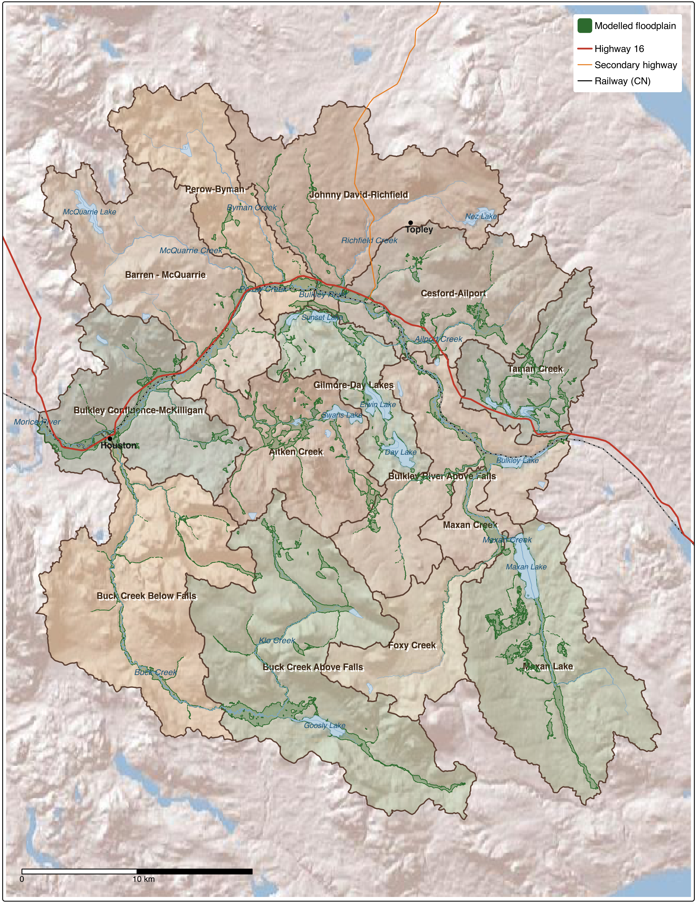
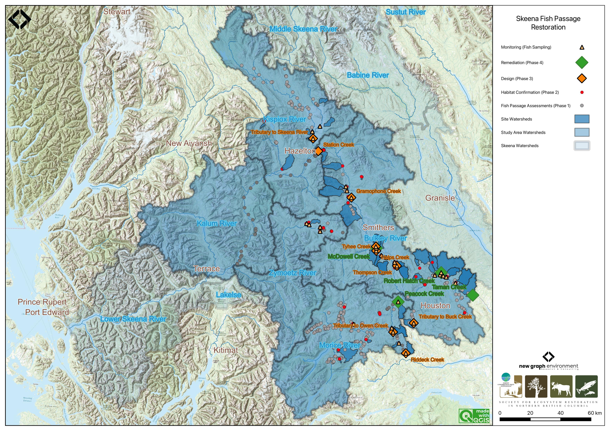
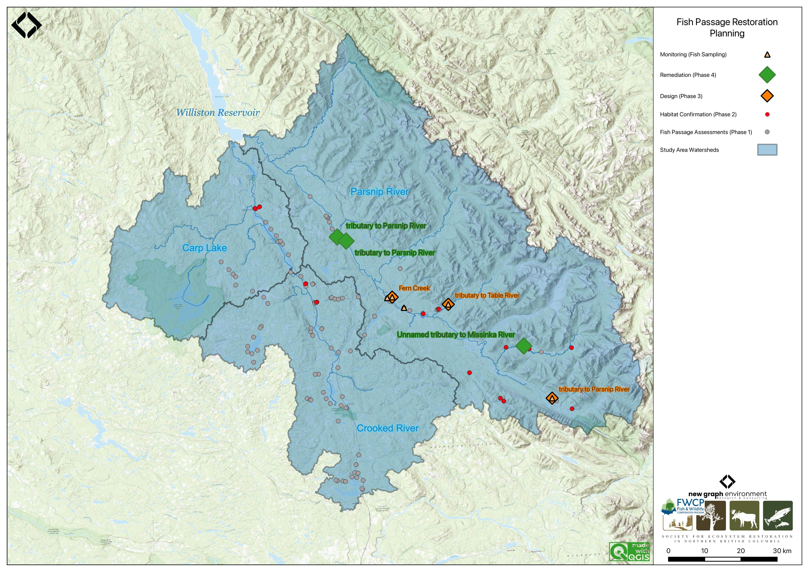
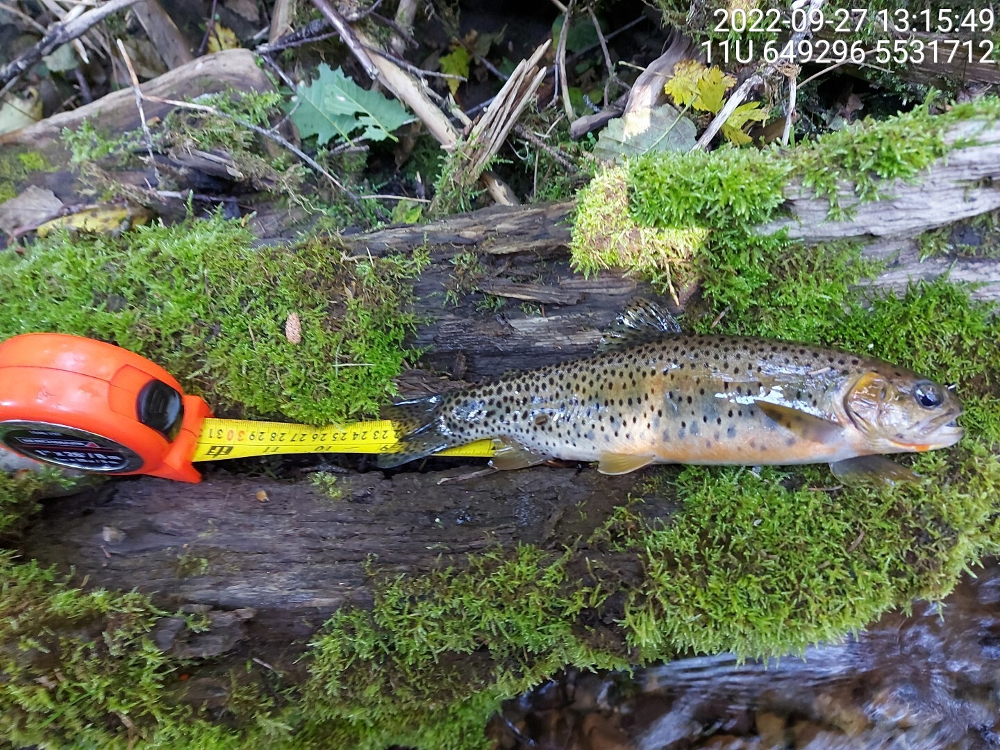

We plan and deliver aquatic restoration at scales ranging from individual stream crossings to entire watersheds. Fish passage assessment and barrier prioritization has been our foundation since 2019, and we are expanding into broader watershed restoration planning that integrates floodplain health, land cover change, riparian condition, and aquatic monitoring.

 

### Neexdzii Kwah Watershed Restoration

The Neexdzii Kwah (Upper Bulkley River) has been noted as containing some of the most intense land use in the Skeena Basin. This initiative develops a living governance and prioritization framework for watershed restoration — placing Wet'suwet'en direction at the centre of decision-making and integrating open-source spatial analysis tools to support planning at the sub-basin scale.

The watershed was divided into 14 sub-basins to enable comparison and investment targeting. Floodplain modelling identified approximately 760 ha of tree cover lost over 2017–2023. Field reviews at 26 locations documented conditions ranging from successful past restoration to riparian degradation far exceeding past investment footprints. A collaborative GIS project integrates all analysis outputs and travels into the field on mobile devices.

  - [Neexdzii Kwah Restoration Planning](https://www.newgraphenvironment.com/restoration_wedzin_kwa_2024/)
  - [Benthic Invertebrate Assessment of the Neexdzii Kwa — 2025](https://www.newgraphenvironment.com/neexdzii_kwa_benthic_2025/)

This work is conducted on behalf of the Wet'suwet'en Treaty Office Society, delivered under the leadership of the Society for Ecosystem Restoration in Northern BC (SERNbc), with technical implementation by New Graph Environment.

 

 

### Fish Passage Restoration Planning

Multi-year fish passage assessment and restoration planning across more than 20 watershed groups in British Columbia. We collaborate with First Nations, provincial agencies, and stewardship organizations to identify barriers, prioritize restoration, and track outcomes. Initiatives have led to substantial funding to support not only fish passage restoration but also cattle exclusion fencing, streambank stabilization, and riparian planting programs.

 

#### Skeena Region

  - [Skeena Watershed Fish Passage Restoration Planning 2024](https://www.newgraphenvironment.com/fish_passage_skeena_2024_reporting/)

Previous Skeena reports

  - [Skeena Watershed Fish Passage Restoration Planning 2023](https://www.newgraphenvironment.com/fish_passage_skeena_2023_reporting/)
  - [Skeena Watershed Fish Passage Restoration Planning 2022](https://www.newgraphenvironment.com/fish_passage_skeena_2022_reporting/)
  - [Bulkley Watershed Fish Passage Restoration Planning 2022](https://www.newgraphenvironment.com/fish_passage_bulkley_2022_reporting/)
  - [Bulkley River and Morice River Watershed Groups Fish Passage Restoration Planning 2021](https://www.newgraphenvironment.com/fish_passage_skeena_2021_reporting/)
  - [Bulkley River and Morice River Watershed Groups Fish Passage Restoration Planning 2020](https://www.newgraphenvironment.com/fish_passage_bulkley_2020_reporting/)

 

 

#### Peace Region

  - [Restoring Fish Passage in the Peace Region 2025](https://www.newgraphenvironment.com/fish_passage_peace_2025_reporting/)
  - [Restoring Fish Passage in the Peace Region 2024](https://www.newgraphenvironment.com/fish_passage_peace_2024_reporting/)

Previous Peace reports

  - [Restoring Fish Passage in the Peace Region 2023](https://www.newgraphenvironment.com/fish_passage_peace_2023_reporting/)
  - [Restoring Fish Passage in the Peace Region 2022](https://www.newgraphenvironment.com/fish_passage_peace_2022_reporting/)
  - [Restoring Fish Passage in the Peace Region 2021](https://www.newgraphenvironment.com/fish_passage_parsnip_2021_reporting/)
  - [Parsnip River Watershed – Fish Habitat Confirmations 2019](https://www.newgraphenvironment.com/Parsnip_Fish_Passage/)

 

 

#### Fraser Region

  - [Fraser River Fish Passage Restoration Planning 2025](https://www.newgraphenvironment.com/fish_passage_fraser_2025_reporting/)
  - [Fraser River Fish Passage Restoration Planning 2023](https://www.newgraphenvironment.com/fish_passage_fraser_2023_reporting/)

 

#### Elk River

  - [Elk River Watershed Group Fish Passage Restoration Planning 2022](https://www.newgraphenvironment.com/fish_passage_elk_2022_reporting/)

Previous Elk reports

  - [Elk River Watershed Group Fish Passage Restoration Planning 2021](https://www.newgraphenvironment.com/fish_passage_elk_2021_reporting/)
  - [Upper Elk River and Flathead River Fish Passage Restoration Planning 2020](https://www.newgraphenvironment.com/fish_passage_elk_2020_reporting/)

 

 

#### Effectiveness Monitoring

  - [Effectiveness Monitoring for Cross Creek, Bittner Creek and Five Mile Creek - 2022](https://www.newgraphenvironment.com/fish_passage_moti_2022_reporting/)

